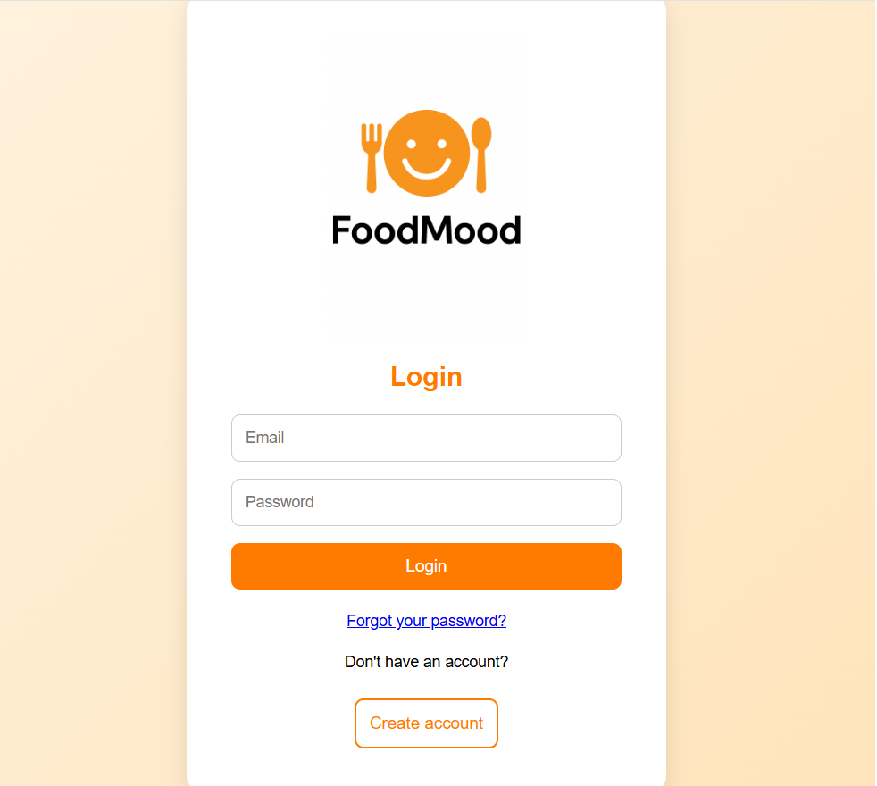
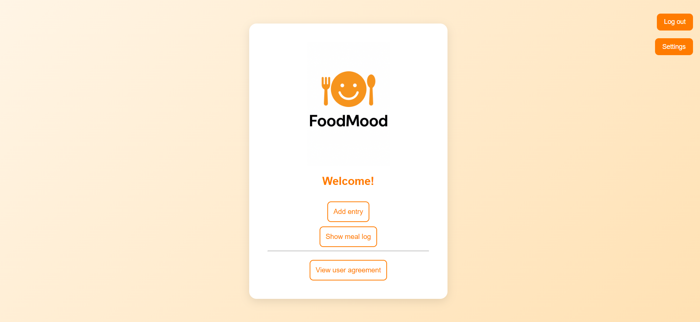
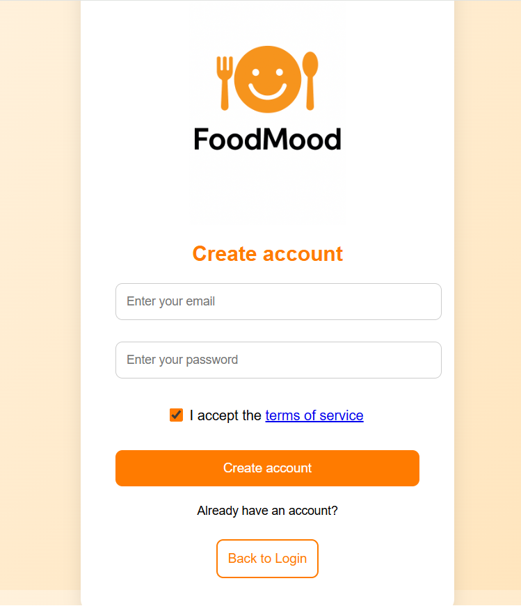
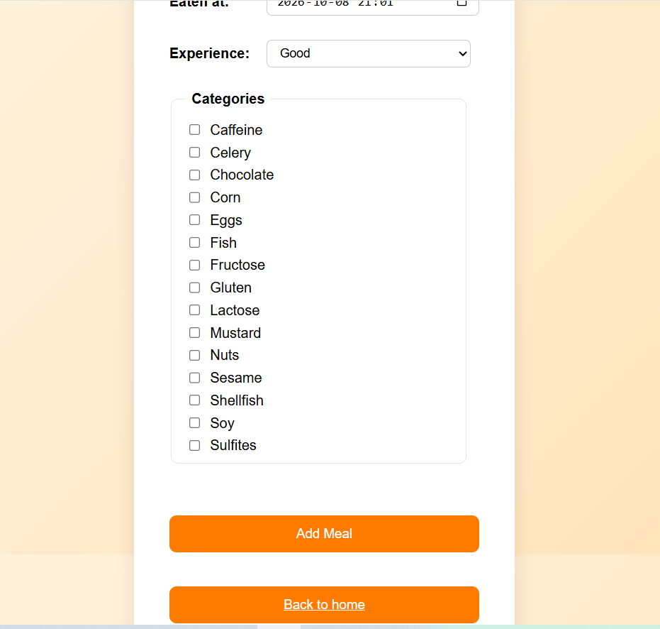
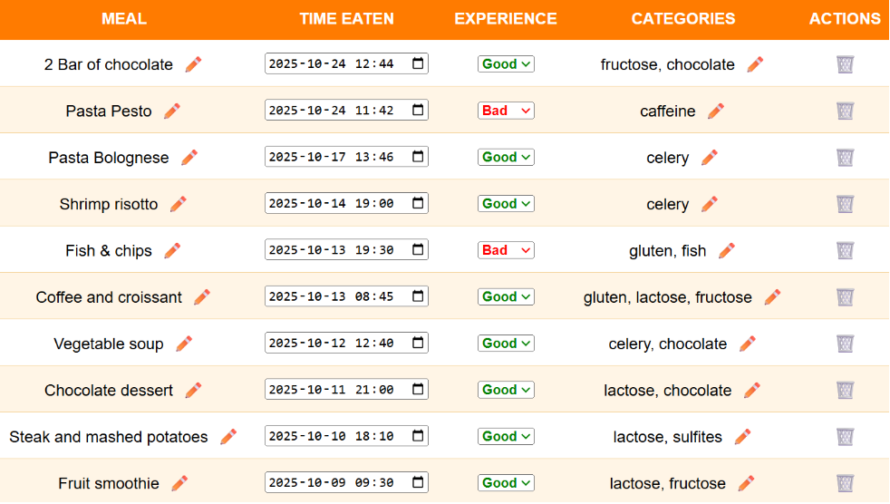
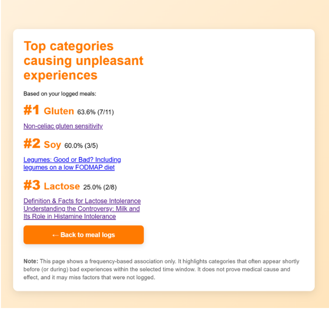
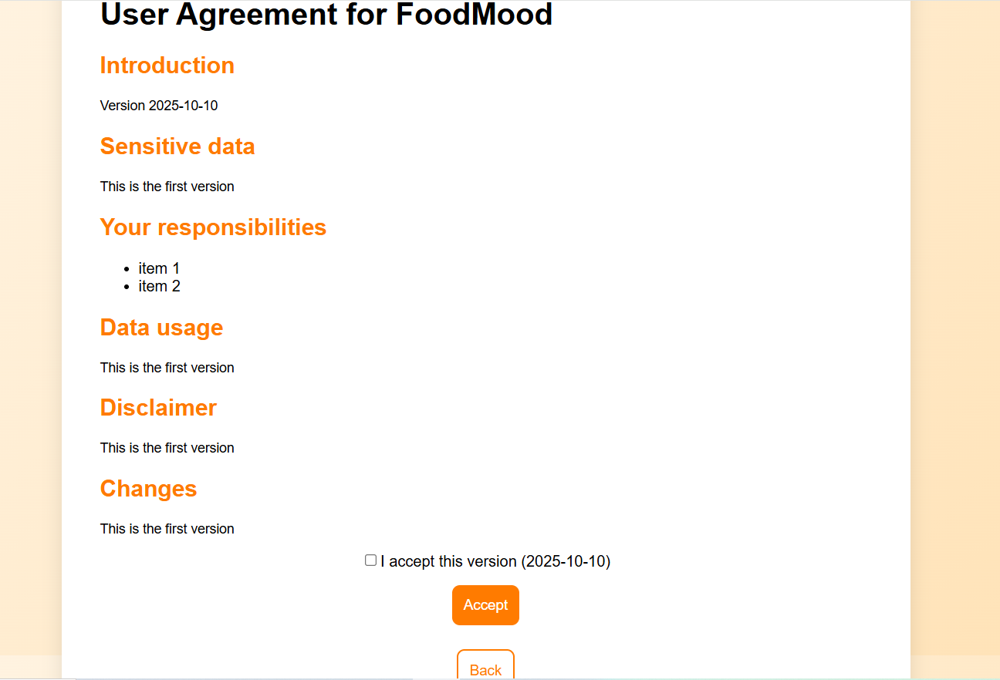

# FoodMood

A full-stack PHP web application designed to help users log meals, track how they felt afterward, and identify patterns between food intake and unpleasant experiences. The project combines a secure user login flow, a personal meal diary, and a simple category analysis to surface possible associations between certain food categories and negative reactions.

## Project overview

FoodMood is built around one core idea: people often want to understand whether certain foods or meal patterns are linked to discomfort or poor mood. Instead of just storing food entries, the app lets users:

- create an account and sign in securely,
- log meals with a timestamp and experience rating,
- label meals with categories such as ingredients or food groups,
- review past logs and update entries,
- analyze the most repeated category patterns before a negative experience,
- access relevant research links connected to those categories.

The result is a personal health-tracking dashboard that feels approachable, lightweight, and focused on data collection and reflection.

## Why this project matters

This app combines data entry, relationship analysis, and user-focused design in a way that is easy to understand for non-technical users. It demonstrates:

- database design and relational modeling,
- secure authentication practices,
- CRUD-style interfaces for personal records,
- session handling in a PHP application,
- analytics logic built directly on user-generated data,
- legal/consent flows for user agreement handling.

---

## Tech stack

- PHP 8+
- MySQL 
- HTML5 + CSS
- PHPMailer for password reset emails
- Apache / local PHP server environment (XAMPP/WAMP/MAMP compatible)

---

## Project structure

```text
project-foodmood/
├── analysis_basic.php         # category association analysis page
├── db.php                     # database connection settings
├── entry.php                  # meal log form
├── home.php                   # landing/dashboard page
├── index.php                  # login page
├── insert.php                 # stores new meal entries
├── login_control.php           # ensures authenticated access + password reset flow
├── logout.php                 # ends the user session
├── meal_log.php               # meal diary and editable log list
├── register.php               # account creation page
├── reset_password_request.php # request password reset email
├── reset_password.php         # set new password
├── settings.php               # analysis settings toggle
├── style.css                  # shared styling
├── style_home.css             # styling for diary/dashboard screens
├── index_style.css            # styling for login and general pages
├── user_agreement.php         # terms and conditions page
├── user_agreement_config.php  # terms version configuration
├── user-agreements/           # HTML agreement versions
├── PHPMailer/                 # email library
├── foodmood.sql               # database schema and seed tables
├── README.md                  # project documentation
└── FoodMood_logo.png          # branding asset
```

---

## Database design

The application uses a MySQL database named `foodmood` with these core tables:

### `users`
Stores account data for each user:

- `id`
- `email`
- `password_hash`
- `terms_accepted_at`
- `terms_version`
- `reset_token`
- `reset_expires`

This table handles registration, login, acceptance of the user agreement, and password reset logic.

### `meal_logs`
Tracks every meal entry created by a user:

- `id`
- `user_id`
- `meal_name`
- `eaten_at`
- `experience`
- `created_at`

The `experience` field is a simple Boolean pattern:

- `0` = good
- `1` = bad

This makes it easier to compare meals that appear before negative experiences.

### `categories`
Defines reusable labels such as food types or meal characteristics.

Each category may include:

- `id`
- `name`
- `description`
- `is_active`

### `meal_log_categories`
A junction table linking a logged meal to one or more categories.

This allows each meal to carry several tags and helps build the analysis results.

### `research_articles`
Contains external research links connected to categories so users can read more about a pattern they may be noticing.

---

## Page-by-page walkthrough

### 1. Login page — [index.php](index.php)

This is the starting point of the app.

Features:

- email + password login form,
- password verification using `password_verify()`,
- session creation on successful login,
- redirect to the home page after authentication,
- forgot-password link,
- link to the registration page.

The login flow also checks whether the user has accepted the latest terms and conditions before allowing continued use.

### 2. Registration page — [register.php](register.php)

New users can create an account here.

Features:

- email registration,
- password strength validation,
- requirement to accept the latest terms of service,
- password hashing with `password_hash()`,
- insertion of a new user into the `users` table.

The page also confirms the current version of the terms presented to the user and prevents registration if the agreement has changed.

### 3. Password reset flow — [reset_password_request.php](reset_password_request.php) and [reset_password.php](reset_password.php)

This flow allows a user to recover access to their account.

Process:

- user enters email address,
- system checks whether the account exists,
- a secure token is generated and stored in the database,
- a reset email is sent using PHPMailer,
- the user clicks the emailed link,
- the app validates the token and time window,
- the password is reset and hash-stored securely.

This is a strong demonstration of practical authentication and account recovery behavior in a PHP app.

### 4. Home page — [home.php](home.php)

The home page acts as the user dashboard and main navigation hub.

Actions available:

- add a meal entry,
- view the meal log,
- open the user agreement,
- access settings,
- log out.

This page is intentionally simple and acts as the central entry point for the app after login.

### 5. Add meal entry — [entry.php](entry.php) and [insert.php](insert.php)

This is where the core tracking experience begins.

The entry form allows a user to:

- add a meal name,
- select the date and time of consumption,
- mark the experience as Good or Bad,
- choose one or more categories associated with the meal.

Once submitted, [insert.php](insert.php) performs a transactional insert:

- saves the meal to `meal_logs`,
- stores the category relationships in `meal_log_categories`,
- rolls back automatically if anything fails.

This demonstrates strong database handling and correct use of relational data storage.

### 6. Meal log and editing dashboard — [meal_log.php](meal_log.php)

This page is the user’s personal history timeline.

Features:

- view recent meals with pagination/limit controls,
- see meal name, timestamp, experience, and associated categories,
- edit the meal name, time, experience, and categories,
- delete entries from the log,
- filter results by 10, 20, 50, or all entries.

This is one of the most important parts of the application because it gives users a way to revise their tracking history and maintain accurate records.

### 7. Analysis page — [analysis_basic.php](analysis_basic.php)

This is the app’s insight engine.

The analysis looks at:

- how often a category appears in a user’s meals,
- whether those meals occur in the lookback window before a bad experience,
- how strong the association is against the user’s overall history,
- which categories appear most frequently before unpleasant outcomes.

The page ranks the top categories and then displays related research links for each one. This turns the app from a diary into a meaningful behavioral pattern tool.

Key logic included:

- category frequency analysis,
- lookback window configuration,
- minimum exposure thresholds,
- rank ordering by percentage and count,
- research article recommendations by category.

### 8. Settings page — [settings.php](settings.php)

The settings page gives the user control over the analysis lookback period.

Users can choose whether they want the analysis to consider:

- a 60-minute lag window before negative experiences,
- or only the meal marked as unpleasant.

This makes the analytics behavior more customizable and user-controlled.

### 9. User agreement flow — [user_agreement.php](user_agreement.php), [user_agreement_config.php](user_agreement_config.php), and [user-agreements](user-agreements)

The project goes beyond basic sign-up by including a legal and compliance layer.

Features:

- versioned user agreement files stored in the `user-agreements` folder,
- current version configuration in `user_agreement_config.php`,
- terms acceptance tracking in the `users` table,
- redirect flow to ensure compliance before continued use,
- acceptance form with CSRF protection and validation.

This demonstrates a stronger product mindset, especially for apps with user consent requirements.

### 10. Database bootstrap — [foodmood.sql](foodmood.sql)

This file contains the database schema for the application, including:

- users,
- meal logs,
- categories,
- meal/category links,
- research articles.

It is the foundation for running the app locally and can be imported into MySQL through phpMyAdmin or the MySQL command line.

---

## User flow summary

1. User lands on the login screen.
2. They create an account or sign in.
3. They log meals with relevant data and tags.
4. The meal history becomes a personal diary.
5. The app analyzes patterns across categories and experiences.
6. The user can refine settings and review research links.
7. The app helps them identify possible issue patterns without being overly clinical or complex.

---

## Setup instructions

### Prerequisites

- PHP installed
- MySQL database server running
- Apache or equivalent local server
- XAMPP/WAMP/MAMP recommended for easy local setup

### Local setup

1. Clone or download this repository into your local web server folder.
2. Start Apache and MySQL.
3. Import [foodmood.sql](foodmood.sql) into a MySQL database named `foodmood`.
4. Update the database credentials in [db.php](db.php) if needed.
5. Open the project in the browser:

```text
http://localhost/project-foodmood/index.php
```

### Default database configuration

The current project uses:

```php
$servername = "localhost";
$username = "root";
$password = "root";
$dbname = "foodmood";
```

If your local environment uses a different MySQL setup, update these values before running the app.

---

## Security notes

This project includes common web app protections such as:

- password hashing with PHP’s built-in password functions,
- session-based authentication,
- reset-token validation,
- CSRF protection in agreement acceptance,
- user-level data restrictions so each user only accesses their own log entries.

This is a practical foundation for a modest but realistic user-facing web application.

---

## Project highlights

- personal nutrition tracking,
- user history management,
- pattern analysis over time,
- relational database design,
- secure login and reset flows,
- awareness of privacy and consent,
- strong focus on user experience and simplicity.

---

## Screenshots

Below are key screens from the application, stored in the `screenshots` folder and ready to be showcased in the project portfolio.

### Login screen


### Home dashboard


### Create account


### Add meal entry


### Meal history


### Analysis page


### User agreement


---

## Final note

FoodMood demonstrates a full web app lifecycle: account creation, logging behavior, data analysis, and secure personal data handling. It is not just a toy project—it reflects what a small, useful data-driven application can look like when designed around a real problem and a user-centered workflow.

An improvement would be to structure the files in folders better. 


